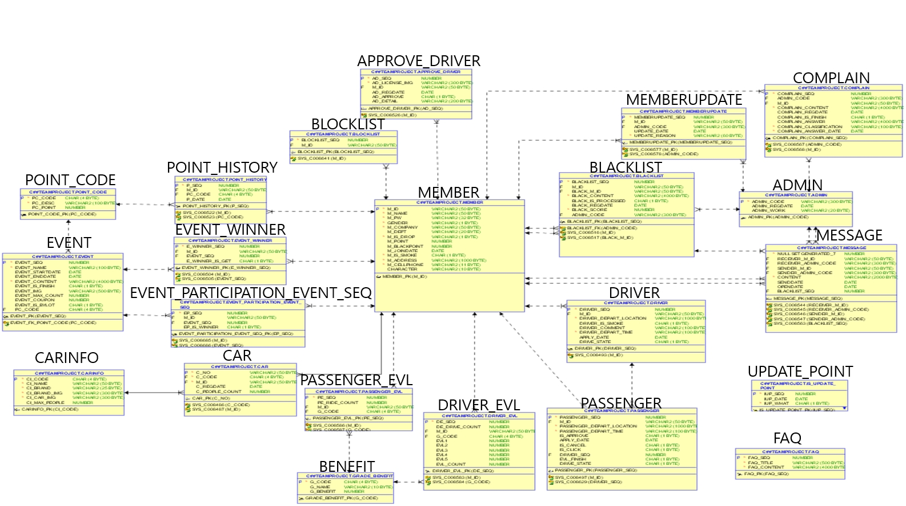
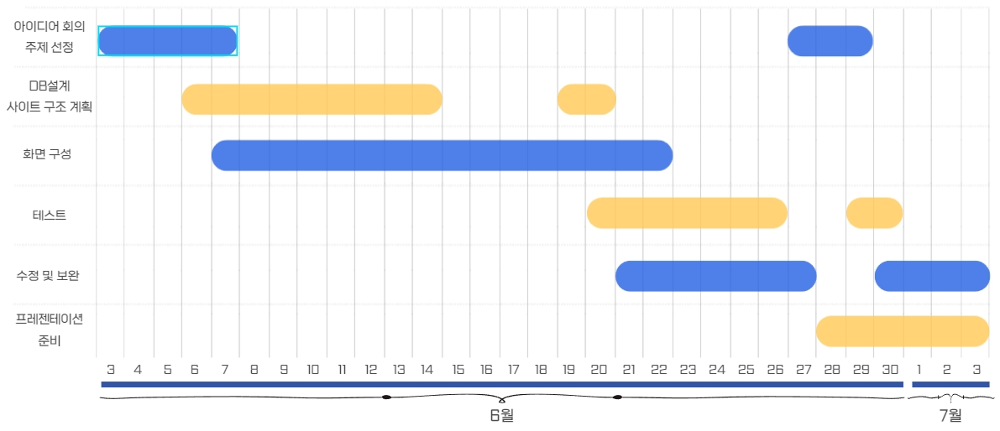
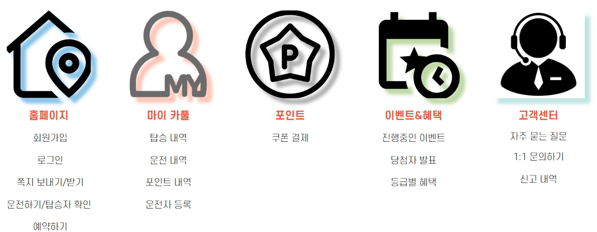
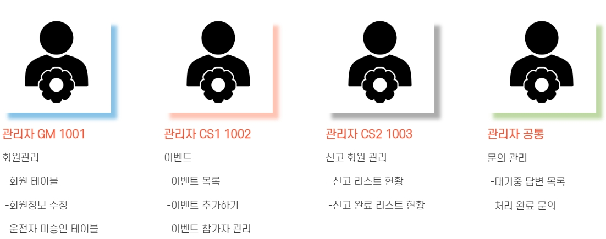

# 🚗얻어타다 | 카풀 서비스

## 카풀❗ 왜 필요할까❓🤷‍♂️
>출근길에서의 불편함을 해소하기 위해서 같은 회사사람들끼리 카풀을 이용하여 **기름값** 상승으로 인한 부담 감소, **교통혼잡** 해소, **환경보호**까지 다양한 이점을 취할 수 있음

## 🖐 이런분들이 이용하면 좋아요❗❗
- 회사까지 출근하는데 시간이 오래 걸린다❗
- 통근버스는 타기싫고 회사까지 편하게 가고싶다❗
- 다른사람들과 친밀감을 쌓고 싶다❗

## 📄 전체 관계도

## ⏳ 개발기간
- 2022.06.03 - 2022.07.03
  

## ⚙ 개발환경
- **O/S** : Windows 10
- **Server** : Apache Tomcat 8.5
- **Java EE IDE** : Eclipse (ver.4.8.0)
- **Development platform** : Spring framework(ver.4.1.7.RELEASE), my batis(ver.3.2.8)
- **Database** : Oracle SQL Developer (ver.21c)
- **Programming Language** : Java, HTML, CSS, JavaScript, JSP, SQL, jQuery
- **VCS(Version Control System)** : Github

## 🗺 사이트 요약
- 메인 페이지
  
- 관리자 페이지
  

## 🤝 구성원

- [김민우](https://github.com/owni14) : 메인 페이지, 운전하기 및 탑승자 확인, 탑승하기, 아이디 및 비밀번호 찾기, 운전자 등록, 카카오 지도 API  
- [김형동](https://github.com/devKimHD) : 이벤트 관리, 이벤트 당첨자 관리, 문의 관리, 완료된 문의 페이지, 관리자 메인 페이지  
- [양희원](https://github.com/yanghuiwon) : 회원관리, 신고 회원 관리, 쪽지 보내기, 등급 그래프, 관리자 메인 페이지  
- [이재곤](https://github.com/jaegonLee1) : 메인 페이지, 회원가입 및 로그인 페이지, 이벤트&혜택 페이지, 고객센터 페이지, 마이카풀 페이지, 포인트 페이지, 유저 쪽지   

## 🔗LINK
- [Controller](https://github.com/owni14/team_project/tree/master/team_project/src/main/java/com/kh/team/controller)
- [Dao](https://github.com/owni14/team_project/tree/master/team_project/src/main/java/com/kh/team/dao)
- [Interceptor](https://github.com/owni14/team_project/tree/master/team_project/src/main/java/com/kh/team/interceptor)
- [Service](https://github.com/owni14/team_project/tree/master/team_project/src/main/java/com/kh/team/service)
- [Util](https://github.com/owni14/team_project/tree/master/team_project/src/main/java/com/kh/team/util)
- [Vo](https://github.com/owni14/team_project/tree/master/team_project/src/main/java/com/kh/team/util)
